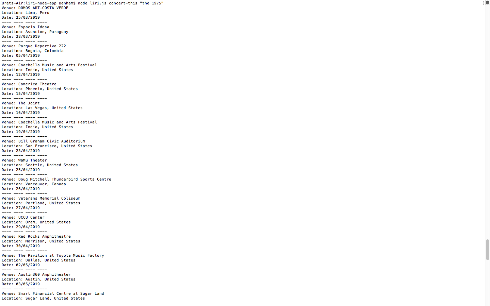

# liri-node-app
<h1>Overview</h1>

Command:  node liri.js 

 

 

Command:  node liri.js concert-this "the 1975"

 

Command:  node liri.js movie-this && node liri.js movie-this "the dark knight"

 

Command:  node liri.js spotify-this-song && node liri.js spotify-this-song "the sound 1975"

 

Command:  node liri.js do-what-it-says

